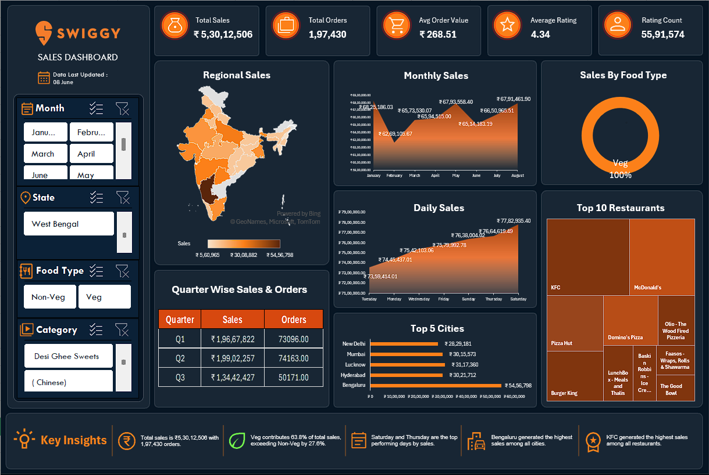

# 🍔 Swiggy Sales Dashboard - Excel Data Analytics Project

## 📊 Dashboard Overview

This project is an interactive Swiggy Sales Dashboard built using Microsoft Excel to analyze sales performance, customer behavior, food category contribution, city-wise sales, and restaurant performance.

## 🚀 Dashboard Preview

## 📈 Key Metrics

* Total Sales
* Total Orders
* Average Order Value (AOV)
* Average Rating
* Rating Count

## 🔍 Analysis Performed

* Regional Sales Analysis
* Monthly Sales Trends
* Daily Sales Trends
* Food Type Contribution Analysis
* Top 5 Cities Analysis
* Top 10 Restaurants Analysis
* Quarter-wise Performance Analysis

## 🛠 Tools & Techniques Used

* Microsoft Excel
* Pivot Tables
* Pivot Charts
* Slicers
* KPI Cards
* INDEX & MATCH
* Dynamic Insights
* Data Visualization

## 💡 Key Insights

* Veg food contributes the majority share of total sales.
* Bengaluru is the highest-performing city by sales.
* KFC emerged as the top-performing restaurant.
* Weekend sales outperform weekdays.

## 📚 Skills Demonstrated

* Data Analysis
* Dashboard Design
* Data Visualization
* Business Intelligence
* Excel Analytics
* Reporting & Insights Generation

## 👨‍💻 Author

Khushal Dak

Aspiring Data Analyst
